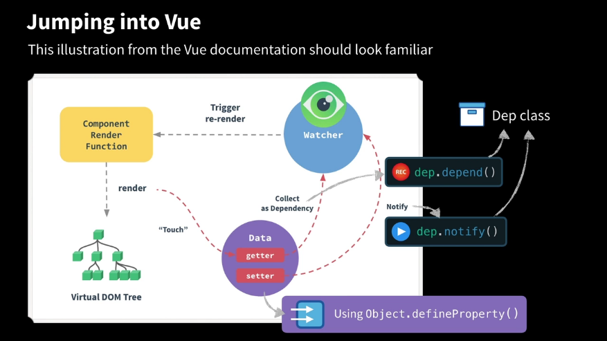

# Advanced components

[Vue Mastery](https://www.vuemastery.com)

Instructor: Gregg Pollack

## Table of Contents <!-- omit in toc -->

- [01. Introduction](#01-introduction)
- [02. Build a Reactivity System](#02-build-a-reactivity-system)
- [03. Evan You on Proxies](#03-evan-you-on-proxies)
- [04. Reactivity in Vue.js](#04-reactivity-in-vuejs)
- [05. Evan You on Vue Core](#05-evan-you-on-vue-core)
- [06. Template Compilation](#06-template-compilation)
- [07. Evan You on the Virtual DOM](#07-evan-you-on-the-virtual-dom)
- [08. Functional Components](#08-functional-components)
- [09. Evan You on Functional Components](#09-evan-you-on-functional-components)
- [10. The Mounting Process](#10-the-mounting-process)
- [11. Evan You on the Mounting Process](#11-evan-you-on-the-mounting-process)
- [12. Scoped Slots & Render Props](#12-scoped-slots--render-props)
  - [Using `v-bind` on the image tag](#using-v-bind-on-the-image-tag)
  - [Scoped slots](#scoped-slots)
  - [Render props](#render-props)

## 01. Introduction


## 02. Build a Reactivity System

- Walking through how reactivity is implemented with vanilla JavaScript
- It's basically a bunch of classes and functions that get called when objects change.
  - Getters
  - Setters
  - Watchers: See [Vue.js docs | Computed properties and watchers](https://vuejs.org/v2/guide/computed.html).
- Final JavaScript code: _./src/reactivity.js_. Run with Node CLI:

  ```node
  ~
  ❯ node
  > .load ./src/reactivity.js
  > total
  10
  > salePrice
  4.5
  > data.price = 20
  20
  > total
  40
  > salePrice
  18
  > data.quantity = 10
  10
  > total
  200
  ```



## 03. Evan You on Proxies

- Lesson resources
  - [Starting code](https://codepen.io/GreggPollack/pen/xjoEOo)
  - [Final code](https://codepen.io/GreggPollack/pen/aKYexR?editors=0012)
  - [Reactivity with Proxies (and more comments)](https://codepen.io/GreggPollack/pen/gKogaE)
- Vue.js 2.x-next will rewrite the reactivity system with Proxies
- [MDN | Proxy API](https://developer.mozilla.org/en-US/docs/Web/JavaScript/Reference/Global_Objects/Proxy)
  - There are many `handler` options, also called "traps" or "interceptors".

## 04. Reactivity in Vue.js

- Investigating where reactivity is implemented in the Vue.js source code. You can walk through the call stack in the browser dev tools, debugger pane.
- [Vue.js data options](https://vuejs.org/v2/api/#Options-Data)
- [src/core/instance/index.js](https://github.com/vuejs/vue/blob/dev/src/core/instance/index.js)
- [src/core/instance/init.js](https://github.com/vuejs/vue/blob/dev/src/core/instance/init.js)
  - We dive into `initState(vm)`. It's in [src/core/instance/state.js](https://github.com/vuejs/vue/blob/dev/src/core/instance/state.js).
- [src/core/observer/index.js](https://github.com/vuejs/vue/blob/dev/src/core/observer/index.js)
  - We see `defineReactive`.

## 05. Evan You on Vue Core

- [src/core/instance/init.js](https://github.com/vuejs/vue/blob/dev/src/core/instance/init.js)

## 06. Template Compilation

- Component template rendering has two steps:
  1. Compilation
  2. Running of the render function
- Vue 3 defaults to runtime only
- Virtual DOM represents the actual DOM with JavaScript objects.
  - Template -> render function -> `VNode`.
- We can use `h('div')` to render DOM elements. `h` is short-hand for createElement.
  ```js
  render(h) {
    return h('div',
                {
                  attrs:
                    {
                      id: 'people'
                    },
                  class: 'sideBar'
                },
                "Gregg and Chase")
  }
  ```
- We can also use render functions with JSX.


## 07. Evan You on the Virtual DOM

- The Vue.js virtual DOM is essentially a fork of Snabbdom.
- Render functions example: [Vue Router view.js](https://github.com/vuejs/vue-router/blob/dev/src/components/view.js)

## 08. Functional Components

- `functional: true`
- [Functional components](https://vuejs.org/v2/guide/render-function.html#Functional-Components) improve performance because they are stateless, and don't have their own component instance. It's sort of like a snippet of JavaScript.
- [router-view](https://github.com/vuejs/vue-router/blob/dev/src/components/view.js#L5) is a functional wrapper component.
- Destructuring context
  ```js
  render(h, { props, data, children }) {
    if (props.items.length > 0 ) {
      return h(NormalTable, data, children)
    } else {
      return h(EmptyTable, data, children)
    }
  }
  ```
- [See Udacity notes on ES6 destructuring](https://github.com/br3ndonland/udacity-google-mws/blob/master/lessons/2-ajax-es6-offline/es6/es6-1-syntax.md#106-destructuring)

  ```js
  const point = [10, 25, -34]
  const x = point[0]
  const y = point[1]
  const z = point[2]
  console.log(x, y, z)
  // output: 10, 25 -34

  const point2 = [10, 25, -34]
  const [a, b, c] = point
  console.log(a, b, c)
  // output: 10, 25 -34
  ```

## 09. Evan You on Functional Components

## 10. The Mounting Process

- Where `mountComponent` is called
  - Called in _/src/platforms/web/runtime.js_
  - Exported from _/src/core/instance/lifecycle.js_
- Where a template gets compiled into a render function
- What `_render` does
- What `_update` does

  

## 11. Evan You on the Mounting Process

> The entry-runtime-with-compiler.js is the full vue.js that is shipped onto the CDNs.

## 12. Scoped Slots & Render Props

_What if we have a list of items, each with a different image?_

### Using `v-bind` on the image tag

We can bind the `img` element to the image for each product.

```html
<div id="app">
  <products-list :products="products"></products-list>
  <products-list :products="products" :show-image="true"></products-list>
</div>

<script src="vue.js"></script>
<script>
  Vue.component("products-list", {
    props: {
      products: {
        type: Array,
        required: true
      },
      showImage: {
        type: Boolean,
        default: false
      }
    },
    template: `
    <ul>
      <li v-for="product in products">
        
        {{ product.name }}
      </li>
    </ul>
  `
  })
  new Vue({
    el: "#app",
    data: {
      products: [
        {
          name: "Magnifying Glass",
          image: "magnify.png"
        },
        {
          name: "Light Bulb",
          image: "bulb.png"
        }
      ]
    }
  })
</script>
```

> The Problem with this Implementation
>
> What happens when sometimes we need our products-list component to also sometimes display price, sale price, add to cart buttons, different styles, or different bullets? What might result is a very brittle component full of v-ifs and v-shows. There has to be a better way!

### Scoped slots

Scoped slots were briefly mentioned in the [Vue Mastery Real-World Vue course lesson on slots](https://www.vuemastery.com/courses/vm02-real-world-vue-js/slots).

#### Deprecated syntax from this course

See the Vue.js docs on the [deprecated slot-scope syntax](https://vuejs.org/v2/guide/components-slots.html#Deprecated-Syntax).

```html
<div id="app">
  <products-list :products="products"></products-list>
  <products-list :products="products">
    <template slot="product" slot-scope="slotProps">
       {{
      slotProps.product.name.toUpperCase() }}
    </template>
  </products-list>
</div>
<script src="vue.js"></script>
<script>
  Vue.component("products-list", {
    props: {
      products: {
        type: Array,
        required: true
      }
    },
    template: `
    <ul>
      <li v-for="product in products">
        <slot name="product" :product="product" >
            {{ product.name }}
        </slot>
      </li>
    </ul>`
  })
  new Vue({
    // Same as above ...
  })
</script>
```

- When adding the child component to the parent component's template, add `<template slot="product" slot-scope="slotProps">` inside the child component template element.
- The `slotProps` are basically any of the props that the child component has.
- See the [Vue.js docs on scoped slots](https://vuejs.org/v2/guide/components.html#Scoped-Slots).
- Scoped slots are used by [vue-multiselect](https://vue-multiselect.js.org/#sub-custom-option-template).

#### Destructuring

See [Vue.js docs on destructuring slot props](https://vuejs.org/v2/guide/components-slots.html#Destructuring-Slot-Props).

```html
<div id="app">
  <products-list :products="products"></products-list>
  <products-list :products="products">
    <template slot="product" slot-scope="{{ product }}">
       {{ product.name.toUpperCase() }}
    </template>
  </products-list>
</div>
<script src="vue.js"></script>
<script>
  Vue.component("products-list", {
    props: {
      products: {
        type: Array,
        required: true
      }
    },
    template: `
    <ul>
      <li v-for="product in products">
        <slot name="product" :product="product" >
            {{ product.name }}
        </slot>
      </li>
    </ul>`
  })
  new Vue({
    // Same as above ...
  })
</script>
```

#### Updated `v-slot` directive

##### Notes

- The [`v-slot` directive](https://vuejs.org/v2/guide/components-slots.html) was introduced in Vue.js 2.6.0.
- The `v-slot` directive syntax is typically only added to `<template>` elements.
- [Named slots](https://vuejs.org/v2/guide/components-slots.html#Named-Slots) are useful when there are multiple slots in the same component template. The `slot` element has a `name` attribute that can be used to define additional slots.

##### Solution

Got this working in CodePen.

```html
<div class="nav-bar"></div>
<div id="app">
  <products-list :products="products">
    <template v-slot:name></template>
    <template v-slot:image></template>
  </products-list>
</div>
<script src="https://cdnjs.cloudflare.com/ajax/libs/vue/2.6.10/vue.min.js"></script>
```

```css
/* Adapted from Vue Mastery Intro lesson 11 on tabs */
body {
  font-family: tahoma;
  color: #282828;
  margin: 0px;
}

.nav-bar {
  background: linear-gradient(-90deg, #84cf6a, #16c0b0);
  height: 60px;
  margin-bottom: 15px;
}

img {
  border: 1px solid #d8d8d8;
  width: 25%;
  margin: 40px;
  box-shadow: 0px 0.5px 1px #d8d8d8;
}
```

```js
Vue.component("products-list", {
  props: {
    products: {
      type: Array,
      required: true
    }
  },
  template: `
  <ul>
    <li v-for="product in products">
      <slot name="name">
        <h3>{{ product.name.toUpperCase() }}</h3>
      </slot>
      <slot name="image">
        
      </slot>
    </li>
  </ul>`
})
new Vue({
  el: "#app",
  data: {
    products: [
      {
        name: "Magnifying Glass",
        image:
          "https://upload.wikimedia.org/wikipedia/commons/c/c6/Mag_glass_request.jpg"
      },
      {
        name: "Light Bulb",
        image:
          "https://upload.wikimedia.org/wikipedia/commons/5/5c/Led_light_bulb_-_led_lamp_1.png"
      }
    ]
  }
})
```

### Render props

- Also see [06. Template Compilation](#06-template-compilation).
- We send in a render function as a prop.
- When demonstrating render props, Gregg uses a [Storybook](https://storybook.js.org/) to run [Vue-Autosuggest](https://github.com/darrenjennings/vue-autosuggest).
- I found this pretty awkward. I much prefer the `v-slot` directive.

```html
<div class="nav-bar"></div>
<div id="app">
  <products-list
    :products="products"
    :product-renderer="imageRenderer"
  ></products-list>
</div>
<script src="https://cdnjs.cloudflare.com/ajax/libs/vue/2.6.10/vue.min.js"></script>
```

```css
/* Adapted from Vue Mastery Intro lesson 11 on tabs */
body {
  font-family: tahoma;
  color: #282828;
  margin: 0px;
}

.nav-bar {
  background: linear-gradient(-90deg, #84cf6a, #16c0b0);
  height: 60px;
  margin-bottom: 15px;
}

img {
  border: 1px solid #d8d8d8;
  width: 25%;
  margin: 40px;
  box-shadow: 0px 0.5px 1px #d8d8d8;
}
```

```js
Vue.component("products-list", {
  props: {
    products: {
      type: Array,
      required: true
    },
    productRenderer: {
      // <-- Here's our new prop
      type: Function,
      default(h, product) {
        // <-- By default just print the name
        return product.name
      }
    }
  },
  render(h) {
    return h("ul", [
      this.products.map(
        product => h("li", [this.productRenderer(h, product)]) // use our new prop
      )
    ])
  }
})
new Vue({
  el: "#app",
  data: {
    products: [
      {
        name: "Magnifying Glass",
        image:
          "https://upload.wikimedia.org/wikipedia/commons/c/c6/Mag_glass_request.jpg"
      },
      {
        name: "Light Bulb",
        image:
          "https://upload.wikimedia.org/wikipedia/commons/5/5c/Led_light_bulb_-_led_lamp_1.png"
      }
    ],
    imageRenderer(h, product) {
      // <-- The imageRenderer I'm passing in
      return [
        h("img", {
          attrs: {
            src: product.image
          }
        }),
        " ",
        product.name.toUpperCase()
      ]
    }
  }
})
```

**COURSE COMPLETE!!! I RULE!!!**


