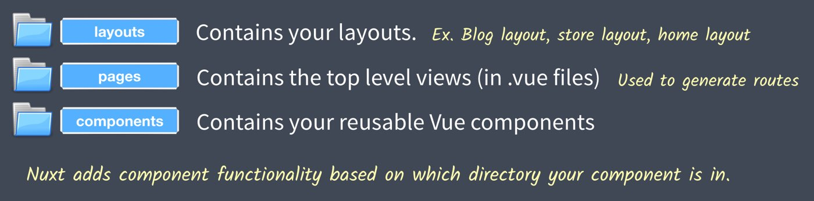
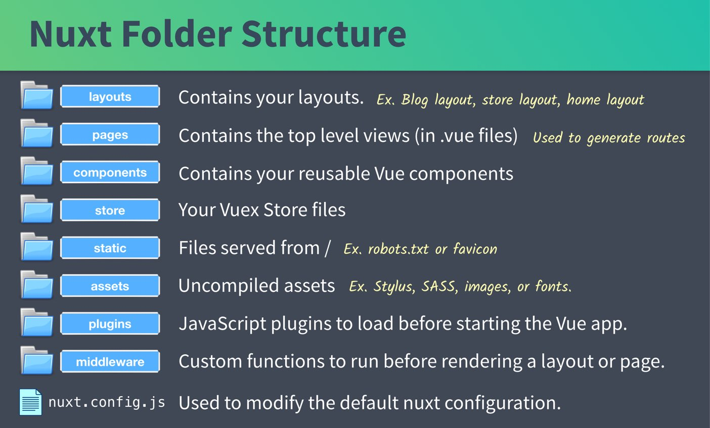
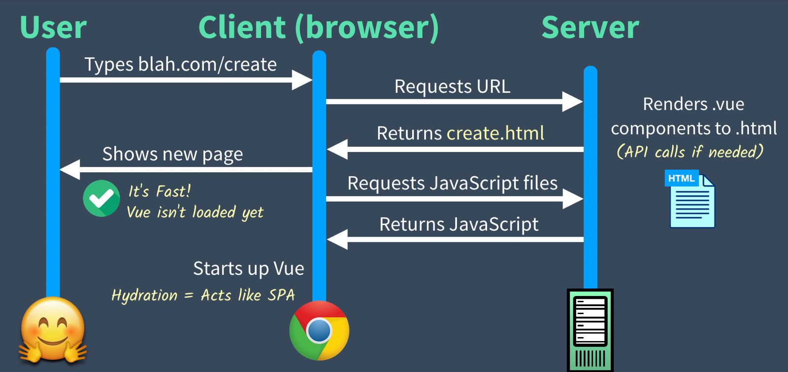
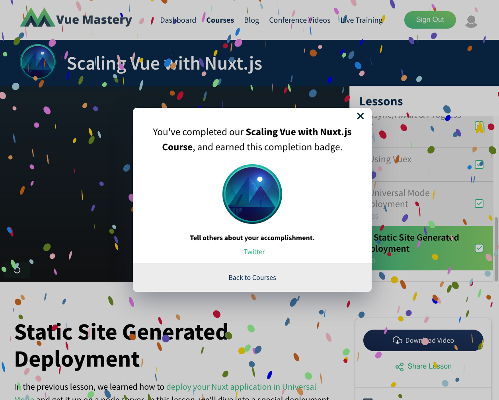

# Nuxt.js

[Vue Mastery](https://www.vuemastery.com)

[Scaling Vue with Nuxt.js](https://www.vuemastery.com/courses/scaling-vue-with-nuxt-js)

## Table of Contents <!-- omit in toc -->

- [01. Why use Nuxt.js?](#01-why-use-nuxtjs)
  - [Problem #1: Building a production-ready Vue app from scratch is difficult](#problem-1-building-a-production-ready-vue-app-from-scratch-is-difficult)
  - [Problem #2: No standard folder structure](#problem-2-no-standard-folder-structure)
  - [Problem #3: Routing configuration can get long in a big Vue app](#problem-3-routing-configuration-can-get-long-in-a-big-vue-app)
  - [Problem #4: No standard way to configure things all together](#problem-4-no-standard-way-to-configure-things-all-together)
  - [Problem #5: Vue apps are not SEO-friendly](#problem-5-vue-apps-are-not-seo-friendly)
  - [Problem #6: Vue applications on initial load can be slow](#problem-6-vue-applications-on-initial-load-can-be-slow)
  - [Problem #7: With a Vue app you may find it difficult to change the behavior of the framework](#problem-7-with-a-vue-app-you-may-find-it-difficult-to-change-the-behavior-of-the-framework)
  - [Conclusion](#conclusion)
- [2. Creating a Nuxt app](#2-creating-a-nuxt-app)
- [3. Universal mode](#3-universal-mode)
- [4. SEO with vue-meta](#4-seo-with-vue-meta)
- [5. File-based routing](#5-file-based-routing)
- [6. API calls with Axios](#6-api-calls-with-axios)
- [7. Async/Await & progress bar](#7-asyncawait--progress-bar)
- [8. Using Vuex](#8-using-vuex)
- [9. Universal mode deployment](#9-universal-mode-deployment)
- [10. Static site generated deployment](#10-static-site-generated-deployment)

## [01](https://www.vuemastery.com/courses/scaling-vue-with-nuxt-js/why-use-nuxt/). Why use Nuxt.js?

> **7 Problems you can avoid by using Nuxt.js for your next Vue app**
>
> Vue.js is a great choice as a framework for your application. But, there are a couple concerns you’ll likely run into:
>
> - How do I combine and configure all my JavaScript & Vue libraries to work together effectively?
> - How do I structure my application code using best practices?
> - How do I make sure my application is properly indexed by search engines?
> - How do I optimize my Vue application for speed?
>
> These are some of the concerns that Sebastien and Alexandre Chopin set out to solve when they created Nuxt.js, a higher-level framework that’s built _on top of_ Vue to help you build production-ready Vue applications.
>
> I want to let you in 7 problems you’re going to run into building a Vue app, and tell you how Nuxt solves them.

### Problem #1: Building a production-ready Vue app from scratch is difficult

> Not only does Nuxt come preconfigured with Vuex, Vue Router, and Vue-Meta, but it sets your project up with intelligent defaults based on well researched best practices that Vue won’t give you out of the box.
>
> Creating a Nuxt app is as easy as typing: `$ npx create-nuxt-app <project-name>`
>
> The Nuxt Starter Kit will ask you for the libraries you want to start your project with, such as CSS Lint, and which CSS framework to use.

### Problem #2: No standard folder structure

> As your application grows your code organization becomes more important. Vue’s default build gives you an **assets** and **components** directory, which is a good start. Nuxt.js sets you up with additional folders based on best practices, such as:
>
> 📂 A `pages` directory for your Application views and routes.
>
> 📂 A `layouts` directory for your layout templates.
>
> 📂 A `store` directory for your Vuex store files.
>
> Nuxt ships with more folders and more default conventions which are all configurable, but you get the idea.
>
> **Since everything has its place, moving from one Nuxt application to another as a developer and getting up to speed is super simple.**

### Problem #3: Routing configuration can get long in a big Vue app

> With Nuxt, you simply place your single file Vue components into the pages folder and Nuxt automatically generates your routes with zero configuration.
>
> This is just one more example of how Nuxt gives you the pre-configuration you need to create production-ready Vue applications. This leads us to the next problem with big applications…

### Problem #4: No standard way to configure things all together

> Luckily, **Nuxt ships with a production ready configuration that doesn’t lock you in.** Meaning if you do you want to override any of the smart defaults or pre-configuration you can edit your nuxt.config.js file and modify any of the framework’s options.

### Problem #5: Vue apps are not SEO-friendly

> You’re going to want certain pages of your app properly indexed by search engines so they’re easily discoverable.
>
> One of the best solutions is to pre-render your Vue pages on the server, but this can be tricky to setup on your own. Nuxt is pre-configured to generate your application on the server, along with powering up your routes to make it easy to add SEO-related tags.

### Problem #6: Vue applications on initial load can be slow

> With Nuxt.js if you choose to render your application universally or statically, the pre-rendered HTML causes your page to load faster in the browser. Once it’s loaded, it’ll start running as a normal SPA. Plus with automatic code-splitting it’s only going to load the JavaScript needed to make the route function.
>
> This makes for the optimal user experience.

### Problem #7: With a Vue app you may find it difficult to change the behavior of the framework

> When you are developing production-grade applications, at some point you’ll need to change the behavior of the framework. Nuxt provides a **higher-order module system** that makes it easy to customize every aspect of Nuxt.

### Conclusion

> So there you have it, 7 problems that Nuxt solves for you. As you can see, **Nuxt.js allows you to spend less time on configuration, and more time solving problems and building awesome Vue apps.**
>
> To get started with Nuxt we recommend jumping into the great documentation, and consider downloading the [Vue Mastery Nuxt cheat sheet](https://www.vuemastery.com/nuxt-cheat-sheet/). By doing this you’ll also be notified when we start releasing additional lessons of our Nuxt course.

## 2. Creating a Nuxt app

- `npx create-nuxt-app <project-name>`
- Nuxt does a great job of separating container and presentational components, which was an early application design pattern in React. Listen to [Full Stack Radio episode 122](http://www.fullstackradio.com/122) 20190828 with Matt Biilmann from Netlify.

  

- Overall Nuxt folder structure:

  

## 3. Universal mode

- **Universal mode** is basically **Server-Side Rendering (SSR)**.
- Client-side single-page apps:

  

- SSR apps:

  

- **Hydration**:
  - An app with SSR performs the initial page load by returning only HTML for fast load times.
  - After the client has received the app's JavaScript, it then "hydrates" the HTML so it behaves like a normal SPA.
  - **This is another example of the progressive and approachable nature of Vue.js.** With React, I heard people throwing out terms like hydration from the very beginning, without defining those terms. With Vue.js, I haven't even needed to think about hydration until learning Nuxt.js at an advanced stage.

## 4. SEO with vue-meta

## 5. File-based routing

## 6. API calls with Axios

## 7. Async/Await & progress bar

- I agree that nested promises are not readable.
- The destructured Axios result was pretty sweet:

  ```js
  async asyncData({ $axios, error }) {
    try {
      const { data } = await $axios.get('http://localhost:3000/events')
      return {
        events: data
      }
    } catch (e) {
      error({
        statusCode: 503,
        message: 'Unable to fetch events events at this time'
      })
    }
  }
  ```

## 8. Using Vuex

- Nuxt has some extra lifecycle hooks, such as `fetch`.
- Nuxt has all the modules [namespaced](https://vuex.vuejs.org/guide/modules.html#namespacing) by default.
- We also use `mapState` here, which is a handy way to access the Vuex store.

  ```js
  import EventCard from '@/components/EventCard.vue'
  import { mapState } from 'vuex'  // <--- To map event
  export default {
    ...
    async fetch({ store, error }) {
      try {
        await store.dispatch('events/fetchEvents')
      } catch (e) {
    ...
    },
    computed: mapState({
      events: state => state.events.events
    })
  }
  ```

## 9. Universal mode deployment

- They use Heroku for this lesson.
- [my-json-server](https://my-json-server.typicode.com/) seems great. Would have been helpful for [udacity-google-mws](https://github.com/br3ndonland/udacity-google-mws).

## 10. Static site generated deployment

- We use Netlify in this lesson.
- Universal mode is great when there's a large amount of dynamic content, like a stock ticker.
- Static site deployment generates the HTML once.

**COURSE COMPLETE!!! I RULE!!!**


