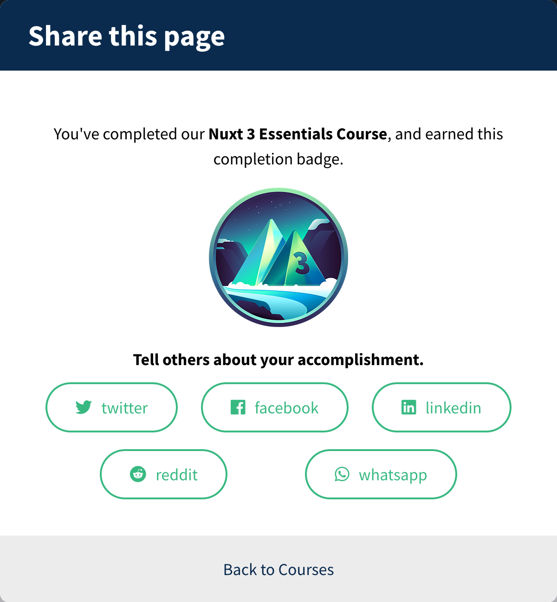

# Nuxt 3 Essentials

[Vue Mastery](https://www.vuemastery.com)

[Nuxt 3 Essentials](https://www.vuemastery.com/courses/nuxt-3-essentials)

[Code on GitHub](https://github.com/Code-Pop/Nuxt-3-Essentials)

Instructor: Steve Edwards

## Table of Contents <!-- omit in toc -->

- [1. Overview](#1-overview)
- [2. Installation and Configuration](#2-installation-and-configuration)
- [3. Creating the URL Structure For Pages](#3-creating-the-url-structure-for-pages)
- [4. Custom Layout and Landing Page Content](#4-custom-layout-and-landing-page-content)
- [5. Creating the Detail Page](#5-creating-the-detail-page)
- [6. Deployment](#6-deployment)

## 1. Overview

Nuxt 3 is a Vue.js framework that overcomes some limitations, including pre-configuration with sensible defaults, custom layouts, search engine optimization (SEO), and server-side rendering (SSR).

The overview compares single-page apps (SPAs) vs. server-side rendered apps (SSR) vs. static sites. These concepts were also discussed in the [original Nuxt course](vue-mastery-nuxt-2.md).

SPAs require the client to render the JavaScript, and work like this:


SSR apps render pages on the server, send the pages to the client right away for fast load times, then "hydrate" the pages with JavaScript as needed. SSR apps work like this:


## 2. Installation and Configuration

- Initialize a new Nuxt 3 app using the instructions at [v3.nuxtjs.org](https://v3.nuxtjs.org/getting-started/installation). The command for [pnpm](https://pnpm.io/) is `pnpm dlx nuxi init <directory_name>`.
- Install the dependencies for the Nuxt 3 app with `pnpm install --shamefully-hoist` in the `nuxt-app` directory.
- Run the dev server with `pnpm dev`.
- [Layouts](https://v3.nuxtjs.org/guide/directory-structure/layouts) will go in the layouts directory.
- [Pages](https://v3.nuxtjs.org/guide/directory-structure/pages) will go in the pages directory.

## 3. Creating the URL Structure For Pages

We will create a site to display info about cryptocurrencies using the [Coinlore](https://www.coinlore.com/) API with two pages:

1. Landing page showing all currencies
2. Detail page for each currency, created with dynamic routing

To start, we need to set up the pages directory, overriding the default `app.vue` as described in the [docs](https://v3.nuxtjs.org/guide/directory-structure/pages).

- Create `pages/index.vue`
- Override `app.vue` by adding `<NuxtPage/>` to the `<template>` in `app.vue`
- Create the currency details page file at `pages/currency/[id].vue`

## 4. Custom Layout and Landing Page Content

- Create `layouts/default.vue` for the default [layout](https://v3.nuxtjs.org/guide/directory-structure/layouts). Use a [slot](https://vuejs.org/guide/components/slots.html) to indicate where the content will go.
  ```vue
  <template>
    <nav>
      <NuxtLink to="/">Home</NuxtLink>
    </nav>
    <main>
      <slot />
    </main>
  </template>
  ```
- Create `server/api/[...].js`. This is a [catch-all route](https://v3.nuxtjs.org/guide/directory-structure/pages/#catch-all-route) using the [`$fetch` global helper](https://v3.nuxtjs.org/api/utils/dollarfetch) that will perform a request to the Coinlore API.
  ```js
  export default (request) => $fetch(`https://api.coinlore.net${request.url}`)
  ```
- Create the homepage in `pages/index.vue`. Note [`useFetch`](https://v3.nuxtjs.org/getting-started/data-fetching), which is a wrapper around the `$fetch` global helper.
  ```vue
  <template>
    <main>
      <h1>Index Page</h1>
      <table border="1 px solid">
        <thead>
          <tr>
            <th>Name</th>
            <th>Symbol</th>
            <th>Price</th>
            <th>Details</th>
          </tr>
        </thead>
        <tr v-for="currency in data.data" :key="data.data.id">
          <td>{{ currency.name }}</td>
          <td>{{ currency.symbol }}</td>
          <td>{{ currency.price_usd }}</td>
          <td>
            <NuxtLink :to="`/currency/${currency.id}`">{{
              currency.id
            }}</NuxtLink>
          </td>
        </tr>
      </table>
    </main>
  </template>
  <script setup>
  const { data } = await useFetch("/api/tickers?limit=10")
  </script>
  ```

## 5. Creating the Detail Page

- The Coinlore API provides details at `https://api.coinlore.net/api/ticker/?id={id}`. Each coin has an integer ID.
- Create the details page at `pages/currency/[id].vue`.
  ```vue
  <template>
    <div>
      <h2>{{ coin.name }} Detail page</h2>
      <table border="1 px solid">
        <thead>
          <th>Symbol</th>
          <th>Rank</th>
          <th>Price - US $</th>
          <th>Market Cap - US $</th>
        </thead>
        <tr>
          <td>{{ coin.symbol }}</td>
          <td>{{ coin.rank }}</td>
          <td>{{ coin.price_usd }}</td>
          <td>{{ coin.market_cap_usd }}</td>
        </tr>
      </table>
    </div>
  </template>
  <script setup>
  const route = useRoute()
  const { data } = await useFetch(`/api/ticker?id=${route.params.id}`)
  const coin = data.value[0]
  </script>
  ```

## 6. Deployment

- The instructor provides instructions for deploying to Netlify. See [Netlify](https://www.netlify.com/with/nuxt/) for more info.
- There are several other platforms that support Nuxt, including Vercel. See the [Nuxt docs](https://nuxtjs.org/deployments/vercel/) and [Vercel](https://vercel.com/templates?framework=vue) for more info.
- See the [Nuxt deployment docs](https://v3.nuxtjs.org/getting-started/deployment) for details on Nuxt 3 Nitro deployment presets.

**COURSE COMPLETE!!! I RULE!!!**


