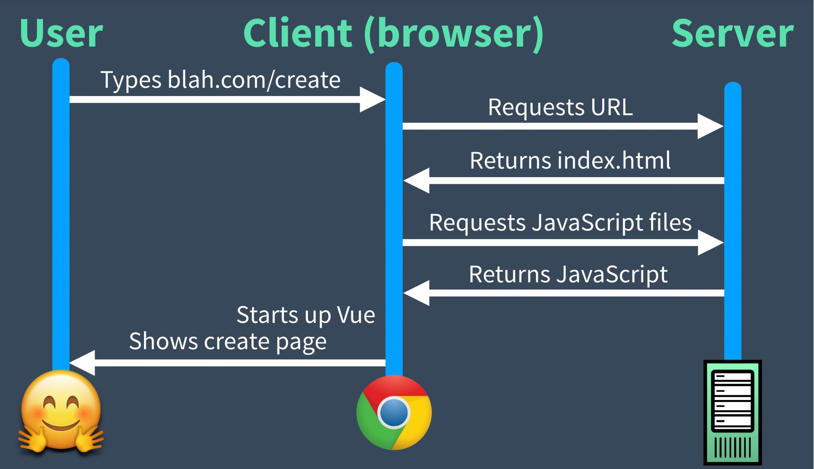

# Nuxt 3 Essentials

[Vue Mastery](https://www.vuemastery.com)

[Nuxt 3 Essentials](https://www.vuemastery.com/courses/nuxt-3-essentials)

Instructor: Steve Edwards

## Table of Contents <!-- omit in toc -->

- [1. Overview](#1-overview)
- [2. Installation and Configuration](#2-installation-and-configuration)
- [3. Creating the URL Structure For Pages](#3-creating-the-url-structure-for-pages)
- [4. Custom Layout and Landing Page Content](#4-custom-layout-and-landing-page-content)
- [5. Creating the Detail Page](#5-creating-the-detail-page)
- [6. Deployment](#6-deployment)

## 1. Overview

Nuxt 3 is a Vue.js framework that overcomes some limitations, including pre-configuration with sensible defaults, custom layouts, search engine optimization (SEO), and server-side rendering (SSR).

The overview compares single-page apps (SPAs) vs. server-side rendered apps (SSR) vs. static sites. These concepts were also discussed in the [original Nuxt course](vue-mastery-nuxt.md).

SPAs require the client to render the JavaScript, and work like this:

SSR apps render pages on the server, send the pages to the client right away for fast load times, then "hydrate" the pages with JavaScript as needed. SSR apps work like this:

## 2. Installation and Configuration

## 3. Creating the URL Structure For Pages

## 4. Custom Layout and Landing Page Content

## 5. Creating the Detail Page

## 6. Deployment
