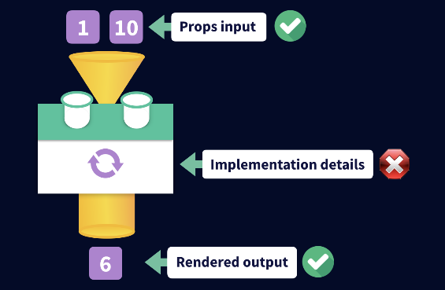
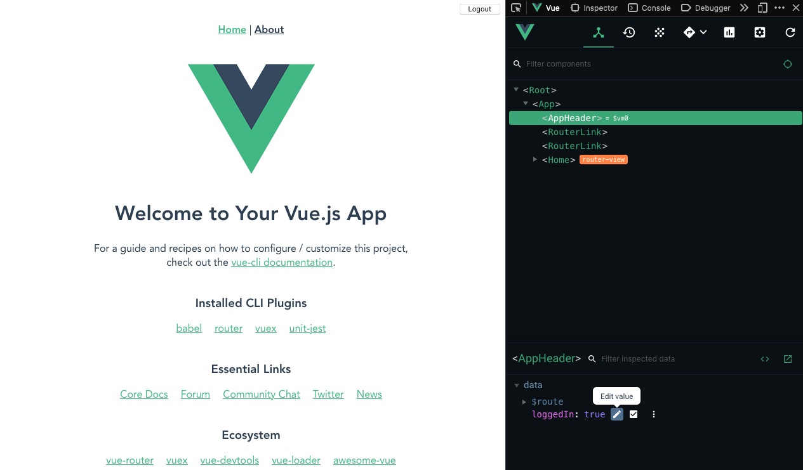

# Testing

[Vue Mastery](https://www.vuemastery.com)

[Unit testing course](https://www.vuemastery.com/courses/unit-testing/what-to-test)

## Table of Contents <!-- omit in toc -->

- [1. What to test](#1-what-to-test)
  - [Benefits of unit testing](#benefits-of-unit-testing)
  - [The component contract](#the-component-contract)
  - [What to test and not test](#what-to-test-and-not-test)
- [2. Writing a Unit Test with Jest](#2-writing-a-unit-test-with-jest)
  - [Vue CLI project creation](#vue-cli-project-creation)
  - [Unit testing steps](#unit-testing-steps)
- [3. Testing Props & User Interaction](#3-testing-props--user-interaction)
  - [Random number component](#random-number-component)
  - [Random number component tests](#random-number-component-tests)
- [4. Testing Emitted Events](#4-testing-emitted-events)
- [5. Testing API Calls](#5-testing-api-calls)
- [6. Stubbing Child Components](#6-stubbing-child-components)
- [7. Testing Vuex](#7-testing-vuex)
- [8. Testing Vue Router](#8-testing-vue-router)

## 1. What to test

### Benefits of unit testing

- **Increased confidence:** effects of changes to code are easier to evaluate.
- **Quality code:** when components are written to be testable, they are more isolated and reusable.
- **Better documentation:** tests help describe how the source code works.

### The component contract

- The units of a Vue.js app are components.
- Each component has a "contract" with the rest of the app.

### What to test and not test



**Test:**

- **Inputs:** data passed in to components
  - Props
  - User interaction
  - [Lifecycle hooks](https://vuejs.org/v2/api/#Options-Lifecycle-Hooks)
  - Vuex data
  - Route params
- **Outputs:**
  - DOM rendering of component
  - External function calls
  - Emitted events
  - Route changes
  - Vuex updates
  - Changes passed to child components

**Don't test:**

- Implementation details
- Framework itself: **if the component has prop types and defaults specified, those will be checked by the Vue core library itself, and don't need further unit tests.**
- Third-party libraries (should have their own tests already)

## 2. Writing a Unit Test with Jest

### Vue CLI project creation

We create a project with Vue CLI. Note that Vue CLI will create a directory with the name given, and initialize the Git repository.

```sh
~
❯ cd ~/dev/vue-mastery

~/dev/vue-mastery
❯ vue create vue-mastery-testing-app
```

```
Vue CLI v4.3.0
? Please pick a preset: Manually select features
? Check the features needed for your project: Babel, Router, Vuex, Linter, Unit
? Use history mode for router? (Requires proper server setup for index fallback in production) Yes
? Pick a linter / formatter config: Prettier
? Pick additional lint features: Lint on save, Lint and fix on commit
? Pick a unit testing solution: Jest
? Where do you prefer placing config for Babel, ESLint, etc.? In dedicated config files
? Save this as a preset for future projects? (y/N) N
```

I then created the GitHub remote with the [GitHub CLI](https://cli.github.com/). My remote is at [br3ndonland/vue-mastery-testing-app](https://github.com/br3ndonland/vue-mastery-testing-app).

```sh
~/dev/vue-mastery
❯ cd vue-mastery-testing-app

~/dev/vue-mastery/vue-mastery-testing-app master
❯ gh repo create br3ndonland/vue-mastery-testing-app --public --enable-issues=false --enable-wiki=false -d "Vue CLI 4 app for Vue Mastery testing course"
✓ Created repository br3ndonland/vue-mastery-testing-app on GitHub
✓ Added remote https://github.com/br3ndonland/vue-mastery-testing-app.git

~/dev/vue-mastery/vue-mastery-testing-app master
❯ git remote set-url origin git@github.com:br3ndonland/vue-mastery-testing-app.git

~/dev/vue-mastery/vue-mastery-testing-app master
❯ git pso master
```

### Unit testing steps

1. **Create test suite** (block of tests): `describe()`
2. **Set up tests**: `test()`
3. **Mount component** with Vue Test Utils: `mount()`
4. **Set data** if necessary: `setData()`
5. **Assert** the expected result: `expect()`

We create a new component, _AppHeader.vue_, and a test file, _AppHeader.spec.js_.

- The component should display a logout button in the header if the user is logged in.
- The input is `loggedIn`.
- The output is the `<button>`.
- We write tests for when users are logged in and logged out, according to the unit testing steps above.
- We assert the expected result with [expect](https://jestjs.io/docs/en/expect) and [matchers](https://jestjs.io/docs/en/using-matchers).
- We have to make the tests wait until the button is mounted to the DOM before they run, so we use async/await to [test asynchronous code](https://jestjs.io/docs/en/asynchronous).

Other things to note:

- Imports from Vue Test Utils use the JavaScript import syntax with curly braces, like `import { mount } from "@vue/test-utils"`, because we are importing specific method exports from Vue Test Utils. Vue component imports normally omit curly braces. See the [Vue Test Utils getting started docs](https://vue-test-utils.vuejs.org/guides/).
- After building _AppHeader.vue_, we import it into _App.vue_ and use it in the template. Although the title of _AppHeader.vue_ is `PascalCase`, we can apparently use the `kebab-case` variant directly in the template, `<app-header />`, without having to explicitly tell Vue.
- Lesson notes on `mount` vs `shallowMount`:
  > In the Vue Test Utils you will also find the method `shallowMount()`. If your component has children, `shallowMount()` will return a simple implementation of that component instead of a fully rendered version. This is important because the focus of a unit test is the component in isolation and not the children of that component.

We don't have a login functionality in the app right now, but we can try changing `loggedIn` with Vue devtools:



## 3. Testing Props & User Interaction

### Random number component

### Random number component tests

#### Check default value

#### Simulate user interaction

#### Set different prop values

## 4. Testing Emitted Events

## 5. Testing API Calls

## 6. Stubbing Child Components

_To be released on May 5_

## 7. Testing Vuex

_To be released on May 12_

## 8. Testing Vue Router

_To be released on May 19_
