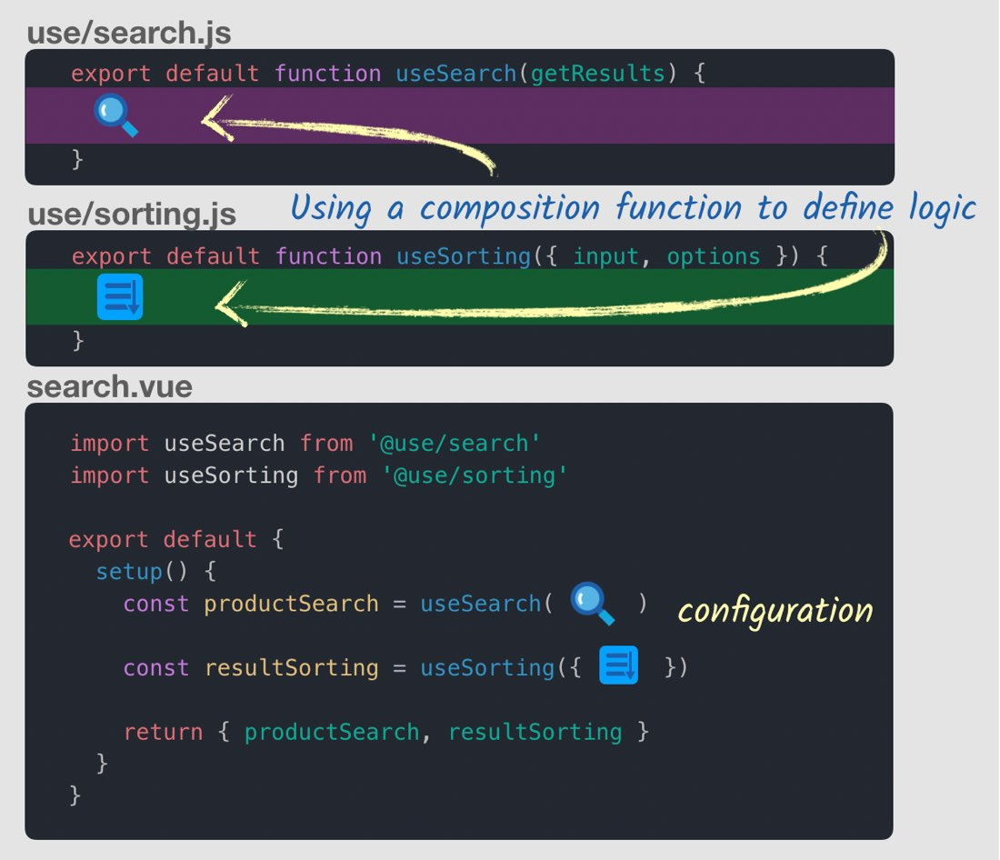

# Vue 3 Essentials

[Vue Mastery](https://www.vuemastery.com)

[Vue 3 Essentials](https://www.vuemastery.com/courses/vue-3-essentials)

## Table of Contents <!-- omit in toc -->

- [1. Why the Composition API](#1-why-the-composition-api)
  - [Readability suffers as components grow](#readability-suffers-as-components-grow)
  - [Code reuse patterns have drawbacks](#code-reuse-patterns-have-drawbacks)
  - [The composition API allows components to be organized by logical concerns](#the-composition-api-allows-components-to-be-organized-by-logical-concerns)
- [2. Setup & Reactive References](#2-setup--reactive-references)
  - [Setup](#setup)
  - [Reactive references](#reactive-references)
- [3. Methods](#3-methods)
- [4. Computed Properties](#4-computed-properties)
- [5. The Reactive Syntax](#5-the-reactive-syntax)
- [6. Modularizing](#6-modularizing)
  - [Organizing component by logical concerns](#organizing-component-by-logical-concerns)
  - [Reusing code across components](#reusing-code-across-components)
- [7. Lifecycle Hooks](#7-lifecycle-hooks)
- [8. Watch](#8-watch)
- [9. Sharing State](#9-sharing-state)
  - [Single-file app](#single-file-app)
  - [Refactoring with the Composition API](#refactoring-with-the-composition-api)

## 1. Why the Composition API

### Readability suffers as components grow

Say you have searching and sorting features in a component. The search and sort features will be split up across sections of the component (data, computed, methods, etc). As the component gets larger, it's difficult to keep track of all the features for searching or sorting.

### Code reuse patterns have drawbacks

Previous options for code reuse:

- Mixins
- Mixin factories
- Scoped slots

### The composition API allows components to be organized by logical concerns

Code for a particular feature, like searching or sorting in the example above, can be collected together inside a new **`setup()` method**:

  

You don't have to include all the code directly inside a massive `setup()` method. The `setup()` method can accept **composition functions** from other files.

  

## 2. Setup & Reactive References

### Setup

- `setup()` is additive, it doesn't replace previous methods.
- Executes before:
  - Components
  - Props
  - Data
  - Methods
  - Computed Properties
  - Lifecycle methods
- We can use a `props` argument to provide props to `setup()`.
- Doesn't have access to `this`. We use the `context` argument instead.
- There's a [Vue 2 plugin for the composition API](https://github.com/vuejs/composition-api) (not recommended for production).

### Reactive references

- Reactive data are wrapped in `ref()`, which is sort of a stand-in for `data()` in the `setup()` function. We first need to `import { ref } from "vue"`.
- We also need to `return` the reactive object.

## 3. Methods

- Methods can be declared as functions inside of `setup()`.
- We don't have access to `this`, so instead we access values inside of reactive references by using the object name.
- When Vue finds a `ref()` in the `template`, it automatically exposes the inner value, so there's no need to modify `{{ capacity }}`.
- The Vue component below is a simple counter, which could show the total capacity at an event.

  ```vue
  <template>
    <div>
      <p>Capacity: {{ capacity }}</p>
      <button @click="increaseCapacity()">Increase Capacity</button>
    </div>
  </template>
  <script>
  import { ref } from "vue"
  export default {
    setup() {
      const capacity = ref(3)
      function increaseCapacity() {
        capacity.value++
      }
      return { capacity, increaseCapacity }
    }
  }
  </script>
  ```

## 4. Computed Properties

- We can also use computed properties inside the `setup()` method.
- As with reactive references, we need to `import { computed } from "vue"`.
- Continuing with the example from above:

  ```vue
  <template>
    <div>
      <p>Spaces Left: {{ spacesLeft }} out of {{ capacity }}</p>
      <h2>Attending</h2>
      <ul>
        <li v-for="(name, index) in attending" :key="index">
          {{ name }}
        </li>
      </ul>
      <button @click="increaseCapacity()">Increase Capacity</button>
    </div>
  </template>
  <script>
  import { ref, computed } from "vue"
  export default {
    setup() {
      const capacity = ref(4)
      const attending = ref(["Tim", "Bob", "Joe"])
      const spacesLeft = computed(() => {
        return capacity.value - attending.value.length
      })
      function increaseCapacity() {
        capacity.value++
      }
      return { capacity, attending, spacesLeft, increaseCapacity }
    }
  }
  </script>
  ```

## 5. The Reactive Syntax

- There's an alternative `reactive()` syntax, with similar syntax to the normal `data()` function. This syntax enables reactivity and destructuring.
- We `import { reactive, toRefs } from "vue"` instead of `ref`.
- We can then destructure the `event` object with `...toRefs(event)`.

  ```vue
  <template>
    <div>
      <p>Spaces Left: {{ spacesLeft }} out of {{ capacity }}</p>
      <h2>Attending</h2>
      <ul>
        <li v-for="(name, index) in attending" :key="index">
          {{ name }}
        </li>
      </ul>
      <button @click="increaseCapacity()">Increase Capacity</button>
    </div>
  </template>
  <script>
  import { reactive, computed, toRefs } from "vue"
  export default {
    setup() {
      const event = reactive({
        capacity: 4,
        attending: ["Tim", "Bob", "Joe"],
        spacesLeft: computed(() => {
          return event.capacity - event.attending.length
        })
      })
      function increaseCapacity() {
        event.capacity++
      }
      return { ...toRefs(event), increaseCapacity }
    }
  }
  </script>
  ```

## 6. Modularizing

- Now that we've established the syntax for the `setup()` function, we return to the key features of the Composition API:
  - Organizing components by logical concerns
  - Reusing code across components

### Organizing component by logical concerns

- Here, we extract the code from the `setup()` function (using the `ref()` syntax from [lesson 4](#4-computed-properties)) into `useEventSpace()`.

  ```vue
  <template>
    <div>
      <p>Spaces Left: {{ spacesLeft }} out of {{ capacity }}</p>
      <h2>Attending</h2>
      <ul>
        <li v-for="(name, index) in attending" :key="index">
          {{ name }}
        </li>
      </ul>
      <button @click="increaseCapacity()">Increase Capacity</button>
    </div>
  </template>
  <script>
  import { ref, computed } from "vue"
  export default {
    setup() {
      return useEventSpace()
    }
  }
  function useEventSpace() {
    const capacity = ref(4)
    const attending = ref(["Tim", "Bob", "Joe"])
    const spacesLeft = computed(() => {
      return capacity.value - attending.value.length
    })
    function increaseCapacity() {
      capacity.value++
    }
    return { capacity, attending, spacesLeft, increaseCapacity }
  }
  </script>
  ```

### Reusing code across components

- Next, we extract `useEventSpace()` into a separate component. The instructor Gregg calls the folder for composition functions _use/_.

  ```js
  // use/event-space.vue
  import { ref, computed } from "vue"
  export default function useEventSpace() {
    const capacity = ref(4)
    const attending = ref(["Tim", "Bob", "Joe"])
    const spacesLeft = computed(() => {
      return capacity.value - attending.value.length
    })
    function increaseCapacity() {
      capacity.value++
    }
    return { capacity, attending, spacesLeft, increaseCapacity }
  }
  ```

- We then import the new component.

  ```vue
  <template>
    <div>
      <p>Spaces Left: {{ spacesLeft }} out of {{ capacity }}</p>
      <h2>Attending</h2>
      <ul>
        <li v-for="(name, index) in attending" :key="index">
          {{ name }}
        </li>
      </ul>
      <button @click="increaseCapacity()">Increase Capacity</button>
    </div>
  </template>
  <script>
  import useEventSpace from "@/use/event-space"
  // import useMapping from "@/use/mapping"
  export default {
    setup() {
      return useEventSpace()
      // Additional components can be added, and the result destructured:
      // return { ...useEventSpace(), ...useMapping() }
    }
  }
  </script>
  ```

- When more composition components are added, the result needs to be destructured to produce valid JavaScript syntax:

  ```vue
  <template>
    <div>
      <p>Spaces Left: {{ spacesLeft }} out of {{ capacity }}</p>
      <h2>Attending</h2>
      <ul>
        <li v-for="(name, index) in attending" :key="index">
          {{ name }}
        </li>
      </ul>
      <button @click="increaseCapacity()">Increase Capacity</button>
    </div>
  </template>
  <script>
  import useEventSpace from "@/use/event-space"
  import useMapping from "@/use/mapping"
  export default {
    setup() {
      return { ...useEventSpace(), ...useMapping() }
    }
  }
  </script>
  ```

## 7. Lifecycle Hooks

- Standard [lifecycle](https://vuejs.org/v2/api/#Options-Lifecycle-Hooks) hooks:
  - `beforeCreate()` - Called immediately after instance is initialized, before options are processed.
  - `created()` - Called after the instance has been created.
  - `beforeMount()` - Right before mounting of the DOM begins
  - `mounted()` - Called when the instance has been mounted (browser updated).
  - `beforeUpdate()` - Called when reactive data has changed, before the DOM is re-rendered.
  - `updated()` - Called when reactive data has changed, and the DOM has been re-rendered.
  - `beforeDestroy()` - Called right before the Vue instance is destroyed.
  - `destroyed()` - Called after the Vue instance has been destroyed.
- Newer Vue 2 lifecycle hooks:
  - `activated()` - Used for , when a component inside is toggled on.
  - `deactivated()` - Used for , when a component inside is toggled off.
  - `errorCaptured()` - Called when an error from any descendent component is captured.
- Renamed Vue 3 lifecycle methods (this is additive - old syntax still works)

  - `beforeDestroy()` -> `beforeUnmount()`
  - `destroyed()` -> `unmounted()`

- Callback hooks are created inside `setup()` by adding `on` to the callback name. The `beforeCreate()` method is not needed because it is called before `setup()`. Likewise, `created()` is not needed because it is called after `setup()`. Code previously placed in `beforeCreate()` or `created()` (like API calls) should be placed directly inside `setup()`:

  ```js
  import {
    onBeforeMount,
    onMounted,
    onBeforeUpdate,
    onUpdated,
    onBeforeUnmount,
    onUnmounted,
    onActivated,
    onDeactivated,
    onErrorCaptured
  } from "vue"
  export default {
    setup() {
      onBeforeMount(() => {
        console.log("Before Mount!")
      })
      onMounted(() => {
        console.log("Mounted!")
      })
      onBeforeUpdate(() => {
        console.log("Before Update!")
      })
      onUpdated(() => {
        console.log("Updated!")
      })
      onBeforeUnmount(() => {
        console.log("Before Unmount!")
      })
      onUnmounted(() => {
        console.log("Unmounted!")
      })
      onActivated(() => {
        console.log("Activated!")
      })
      onDeactivated(() => {
        console.log("Deactivated!")
      })
      onErrorCaptured(() => {
        console.log("Error Captured!")
      })
    }
  }
  ```

- New Vue 3 lifecycle methods
  - `onRenderTracked()` - called when a reactive dependency is first being accessed in the render function, during render. This dependency will now be tracked. This is helpful to see which dependencies are being tracked, for debugging.
  - `onRenderTriggered()` - Called when a new render is triggered, allowing you to inspect what dependency triggered a component to re-render.

## 8. Watch

- To watch reactive references, we `import { watch } from "vue"`
- We can then add the `watch()` method inside `setup()`, including the necessary changes to the reactive references. Multiple reactive references can be passed inside an array.
- In this example, _event.js_ is a simple API the instructor created.

  ```vue
  <template>
    <div>
      <input v-model="firstName" label="First name:" />
      <input v-model="lastName" label="Last name:" />
      <div>
        <p>Name entered: {{ firstName }} {{ lastName }}</p>
      </div>
    </div>
  </template>
  <script>
  import { ref } from "@vue/composition-api"
  import eventApi from "@/api/event.js"
  export default {
    setup() {
      const firstName = ref("")
      const LastName = ref("")
      const firstNameResults = ref(0)
      const lastNameResults = ref(0)
      watch([firstName, lastName], () => {
        firstNameResults.value = eventApi.getEventCount(firstName.value)
        lastNameResults.value = eventApi.getEventCount(lastName.value)
      })
      return { searchInput, results }
    }
  }
  </script>
  ```

- In addition to the newly updated values, the previous values can still be accessed with additional arguments to `watch()`, in the format `watch([trigger1, trigger2], (newVals, oldVals))`:

  ```js
  watch([firstName, lastName], ([newFirst, newLast], [oldFirst, oldLast]) => {
    ...
  });
  ```

## 9. Sharing State

It's often helpful to refactor API calls into separate files.Here, we build on the code from the previous lesson, starting with a single-file Vue app.

### Single-file app

_/src/App.js_

```vue
<template>
  <div>
    Search for <input v-model="searchInput" />
    <div>
      <p>Loading: {{ loading }}</p>
      <p>Error: {{ error }}</p>
      <p>Number of events: {{ results }}</p>
    </div>
  </div>
</template>
<script>
import { ref, watch } from "@vue/composition-api"
import eventApi from "@/api/event.js"
export default {
  setup() {
    const searchInput = ref("")
    const results = ref(null)
    const loading = ref(false)
    const error = ref(null)
    async function loadData(search) {
      loading.value = true
      error.value = null
      results.value = null
      try {
        results.value = await eventApi.getEventCount(search.value)
      } catch (err) {
        error.value = err
      } finally {
        loading.value = false
      }
    }
    watch(searchInput, () => {
      if (searchInput.value !== "") {
        loadData(searchInput)
      } else {
        results.value = null
      }
    })
    return { searchInput, results, loading, error }
  }
}
</script>
```

### Refactoring with the Composition API

_/composables/use-promise.js_

```js
import { ref } from "@vue/composition-api"
export default function usePromise(fn) {
  // fn is the actual API call
  const results = ref(null)
  const loading = ref(false)
  const error = ref(null)
  const createPromise = async (...args) => {
    // Args is where we send in searchInput
    loading.value = true
    error.value = null
    results.value = null
    try {
      results.value = await fn(...args) // Passing through the SearchInput
    } catch (err) {
      error.value = err
    } finally {
      loading.value = false
    }
  }
  return { results, loading, error, createPromise }
}
```

_/src/App.js_

```vue
<template>
  <div>
    Search for <input v-model="searchInput" />
    <div>
      <p>Loading: {{ getEvents.loading }}</p>
      <p>Error: {{ getEvents.error }}</p>
      <p>Number of events: {{ getEvents.results }}</p>
    </div>
  </div>
</template>
<script>
import { ref, watch } from "@vue/composition-api"
import eventApi from "@/api/event.js"
import usePromise from "@/composables/use-promise"
export default {
  setup() {
    const searchInput = ref("")
    const getEvents = usePromise(search => eventApi.getEventCount(search.value))

    watch(searchInput, () => {
      if (searchInput.value !== "") {
        getEvents.createPromise(searchInput)
      } else {
        getEvents.results.value = null
      }
    })
    return { searchInput, getEvents }
  }
}
</script>
```

> _Caveat_
>
> When I ran this by members of the Vue core team, they called attention to ...getEvents. Specifically that I shouldn’t be destructuring the object. Without destructuring the data is namespaced under getEvents which makes it more encapsulated and clear where the data is coming from in the component using it...
>
> It looks like Vue 2 with the composition API isn’t properly recognizing my Reactive References and calling .value like it should. I could fix this by adding .value manually orr by actually using Vue 3. I tested the code with Vue 3 and sure enough, it saw the Reactive References and properly displayed the .value.

_Note that the code above is updated without destructuring as recommended._

**COURSE COMPLETE!!! I RULE!!!**


