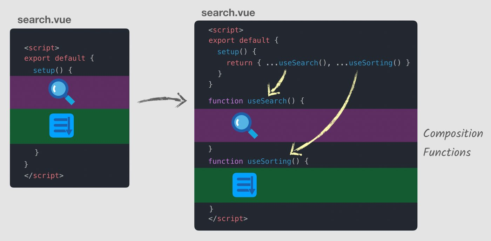

# Vue 3 Essentials

[Vue Mastery](https://www.vuemastery.com)

[Vue 3 Essentials](https://www.vuemastery.com/courses/vue-3-essentials)

## Table of Contents <!-- omit in toc -->

## 1. Why the Composition API

### Readability suffers as components grow

- Say you have searching and sorting features in a component. The search and sort features are split up across sections of the component (data, computed, methods, etc).
- **The composition API allows components to be organized by logical concerns.** All the search features can be collected together, and all the sorting features to be collected together. There's a new **`setup()` method** that accepts **composition functions**.

  

### Code reuse patterns have drawbacks

- Mixins
- Mixin factories
- Scoped slots

### Limited TypeScript support

## 2. Setup & Reactive References

## 3. Methods

## 4. Computed Properties

## 5. The Reactive Syntax

## 6. Modularizing

## 7. Lifecycle Hooks

## 8. Watch

## 9. Sharing State
